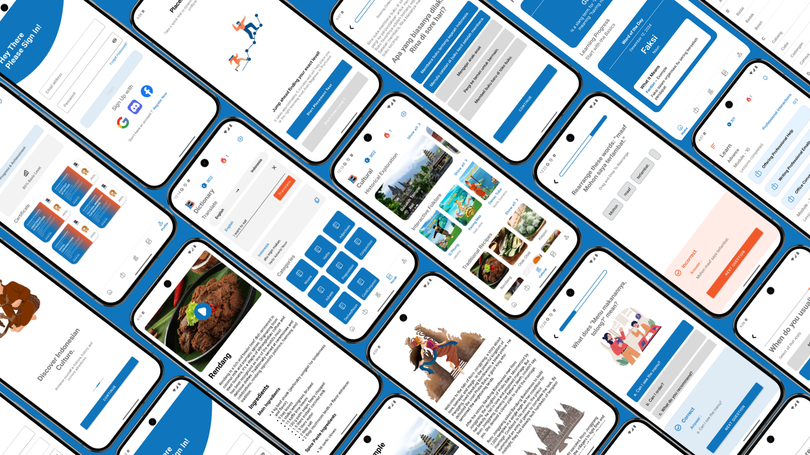

<h1 align="center">
  </img>
  
BahasaIn
</h1>

**BahasaIn** is an innovative mobile application designed to help international students learn Bahasa Indonesia and immerse themselves in Indonesian culture. By combining adaptive learning pathways with cultural integration, BahasaIn provides a comprehensive platform for language acquisition and cultural appreciation. 

---

## **Description**

Indonesia is a culturally rich country with over 275 million people. Despite its vast cultural heritage and language, only a small fraction of international students study in Indonesia due to language barriers. BahasaIn aims to bridge this gap by offering a user-friendly app that not only teaches Bahasa Indonesia but also integrates Indonesian culture into the learning experience.

By providing tools for adaptive learning, cultural integration, and gamification, BahasaIn seeks to make Indonesia a welcoming destination for global learners while promoting Bahasa Indonesia as a global language.

---

## **Screenshots**

Below are some screenshots of the BahasaIn application:
<h1 align="center">
  
    
  BahasaIn
</h1>
For more details, please explore the repository.

---

## **Demo Application**

Experience how BahasaIn works by accessing our demo. Click the link below to try it out:

[**BahasaIn Demo**](https://drive.google.com/drive/folders/1KnjGOB15UTbZB9CBe5dlpt7yhctsj7E7?usp=sharing)

---

## **Installation**

Our application is designed for Android OS. To install BahasaIn, you need an Android device running **Android OS Version 6.0 (Marshmallow)** or higher.

### **Steps to Install:**
1. Download the APK file from the link below:
   [**Download BahasaIn APK**](https://bit.ly/Bahasain-app)
2. Install the APK on your Android device.
3. Open the app and start your language learning journey!

---

## **Prototype Design**

The prototype design of this application was created using Figma. If you are interested in exploring the design, please use the link below:

[**BahasaIn Figma Prototype**](https://www.figma.com/proto/Og6W2yoHzeDcjnPw67bnyj/UI-Applications?node-id=224-1379&t=KdWJnlwoWpSsdune-1&starting-point-node-id=224%3A1379)

---

## **Key Features**

1. **Language Learning Pathways**  
   - Adaptive modules tailored to Beginner, Intermediate, and Advanced levels.
   - Focus on practical vocabulary, conversational skills, and grammar drills.

2. **Cultural Immersion**  
   - Integration of Indonesian folklore, history, and culinary traditions.

3. **Gamification**  
   - Interactive quizzes, progress tracking, and rewards to make learning engaging.

4. **Vocab**  
   - Quick access to commonly used words and phrases.
   - Translation Tool with input text in English to Bahasa Indonesia with quick translation.

5. **Digital Certificates**  
   - Certificates for module completion to showcase achievements.
  

---

## **Repositories**

1. **Machine Learning**
   - https://github.com/Bapakee/Bahasain/tree/main/Machine-Learning
   
3. **Mobile Development**
   - https://github.com/Bapakee/Bahasain/tree/main/Mobile-Development
   
5. **Cloud Computing**
   - (https://github.com/Bapakee/Bahasain/tree/main/Cloud-Computing)

---

# Team Member - C242-PS200

  
| **Bangkit ID**   | **Name**                          | **Learning Path**     | **LinkedIn Profile**                                                                                                                                               | **Status** |
|-------------------|-----------------------------------|------------------------|--------------------------------------------------------------------------------------------------------------------------------------------------------------------|------------|
| M320B4KY3779      | Reynald David Oenata             | Machine Learning       |  | Active     |
| M320B4KY1257      | Emanuel Jordan Rafhaelino Sanjaya | Machine Learning       |            | Active     |
| M320B4KY4527      | Yehuda Phedra Sanjaya            | Machine Learning       |  | Active     |
| C247B4KY2865      | Muhammad Hafi Mufaddhol          | Cloud Computing        |  | Active     |
| C247B4KY2864      | Muhammad Hafi                    | Cloud Computing        |              | Active     |
| A593B4KY0298      | Akmal Kafi Ar Ridho              | Mobile Development     |                    | Active     |
| A284B4KX1963      | Imanuella Yesha Metanoia         | Mobile Development     |                 | Active     |

### Contact
- BahasaIn - @BahasainApp - YOUTUBE CHANNEL
- Project Link: https://github.com/Bapakee/Bahasain/tree/main/Machine-Learning
